 
FingerPrint is an [API](https://github.com/jimp93/Capstone-API/blob/main/ArticleAnalyzerAPI.docx) that utilises the latest developments in Natural Language Processing to create a suite of tools to be used in newsrooms. 
Its models can generate accurate headlines and tweets on the fly, detect potential bias in copy and guide social media content to maximise interactions.  
 

 

Trust in print media is at an all-time low, according to a 2022 Gallup poll.  

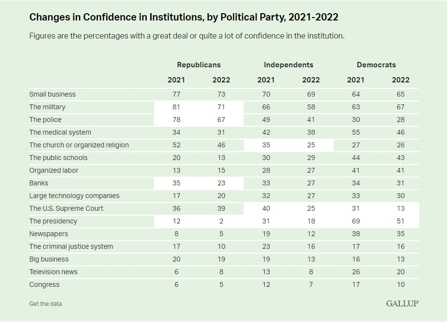
 

The industry has focussed heavily on so-called 'fake news', with fact-checking now a booming sector, but less attention has been paid to how the use of language has affected perception of the news media. 

A market that incentivizes speed over accuracy is also a growing concern. 

AI is going to be a vital tool in tackling these problems, with machine-learning models set to be a fixture in newsrooms of the future. FingerPrint is a first step in that direction. 

The latest generation of NLP 'transformer' models, similar to those that power Google's search engine, are able to encode the inner workings of language with an increasing degree of complexity. 

In the same way the human body uses genetic code to build different parts, the models can decode these language secrets and put them to use on various tasks, opening the door to a new world of functionality and accountability within newsrooms. 
 

**Visualisation of linguistic relationships computed by one attention head in one layer of transformer model**
 

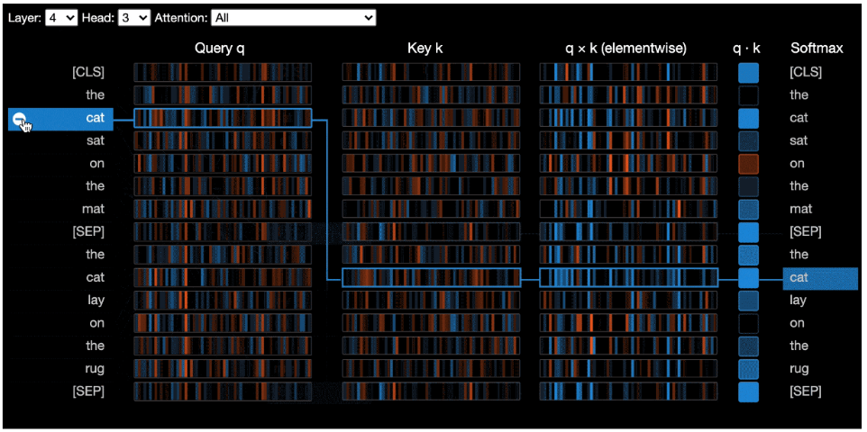 
 

FingerPrint can currently be used by journalists to instantly generate accurate and balanced headlines, by subeditors to identify when opinionated language is appearing in news stories, and by social media teams to quickly curate output for maximum reach. 

But this is just the beginning, with boundless potential for more applications (see [appendix](https://github.com/jimp93/Capstone-API/blob/main/Appendix.docx)).  
 

 

Given memory considerations, GitHub file size restrictions and the processing power of Google Colab, the code is split between GitHub and Colab. The Colab folder can be shared on request. 

Data collection duties were shared across both platforms, with data shuttled between the two through the *import_data* and *export_data* folders in Colab. The rest of the code is on Colab. 
 

 

The models were trained on 1.4 million news articles and 2 million tweets from five outlets: CNN, Fox News, The Guardian, Reuters and the BBC. 

Free-to-use python library [SNScrape](https://github.com/JustAnotherArchivist/snscrape), was used to scrape the tweets. It returns the tweet text, URL links within the tweet and metrics such as likes and retweets.

Code for this is in *global_scripts/twitterScrape.py*, with the final dataframes for each outlet exported to Colab and concatenated. 

For those able to afford $1500, the articles can all be retrieved from the [News API](https://newsapi.org) module. 

This example instead used the Internet [Wayback Machine](https://archive.org/web/) to retrieve the links to articles hosted on the outlet's homepage, going back to 2013. 

These URLs were then used to scrape the actual article and retrieve the text, headline, category, and date. Guardian articles were scraped using its free API. 

Code for this step in each outlet is in *pipe_x/scripts/x_scrape_py*, with the final dataframes exported to Colab and concatenated. 

The article and twitter datasets were then linked as below... 

The *clean.eda* scripts in each folder create another dataframe of features, for instance article text with no stopwords, which is then exported to Colab. 
 

 

## Headline and tweet summarizers
The four models from which the final two are drawn are in the *summarizer* folder in Colab.  

The first model is a rudimentary extractive model, drawn from this [example](https://medium.com/geekculture/neural-machine-translation-using-sequence-to-sequence-model-164a5905bcd7) to get an idea of how they can identify important passages in the text. But the model is unable to learn any complexities of language, thus severely limiting its potential applications. 

The aim was therefore to create an inferential model which can actually learn contextual information and linguistic structure, with the headline and tweet summarizers merely the first of an array of journalistic tools to utilise this ability. 

The first inferential model is an 'lstm', the type often used before the rise in popularity of transformer models. The lstm model uses cells that store the state of model so that relationships of words that appear close together and far apart can be learned, allowing us to feed in long articles. 
 
 
**A repeating long-term short-term memory cell**
 
 

 
 
(Source : http://colah.github.io/posts/2015-08-Understanding-LSTMs)
 
 

The model trained the article text against its headline. In production, the article text is encoded by the trained model, and then decoded to generate a predicted headline, one word at a time. 

The process of vocabulary embedding and the model architecture were drawn heavily from these two sources. 

[embeddings](https://github.com/llSourcell/How_to_make_a_text_summarizer/blob/master/vocabulary-embedding.ipynb) 
[architecture](https://medium.com/geekculture/neural-machine-translation-using-sequence-to-sequence-model-164a5905bcd7) 

The models actually used in the API are T5 transformer models developed by Google. These models build on the lstm's capabilities, but are also able to encode words depending on their context, for instance learning the different meanings of words like 'bank' depending on other words in the sequence. 

They are based on the transformer architecture, as illustrated below... 
 
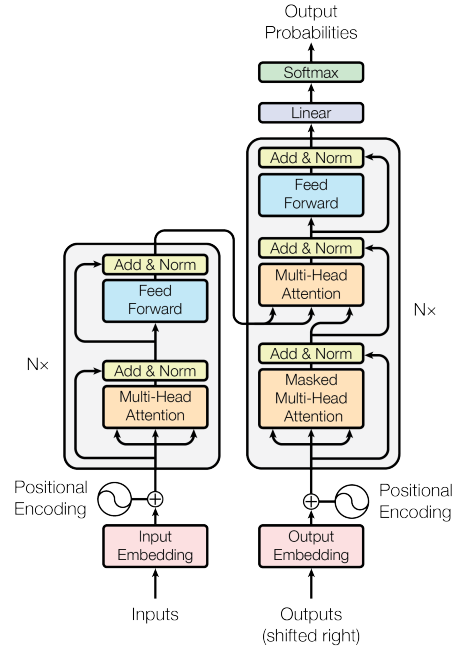
 
(Source : https://arxiv.org/abs/1706.03762)
 

Weights connecting different 'heads' in the model allow them to learn different linguistic relationships, which can be visualised by the [BertViz](https://github.com/jessevig/bertviz) module. Heads are stacked in layers, with each layer capturing more abstracted linguistic features. 

They are pre-trained by being made to predict masked words ([T5s actually mask multiple consecutive words](https://ai.googleblog.com/2020/02/exploring-transfer-learning-with-t5.html), so they predict strings rather than individual words), and then we can fine tune them on individual tasks. 

Our understanding of these inner workings and ability to analyse them are currently limited, but the profound implications as this understanding improves are not difficult to envisage. 
 
 
**Linguistic relationship between article words and predicted headline word for one T5 layer**
 

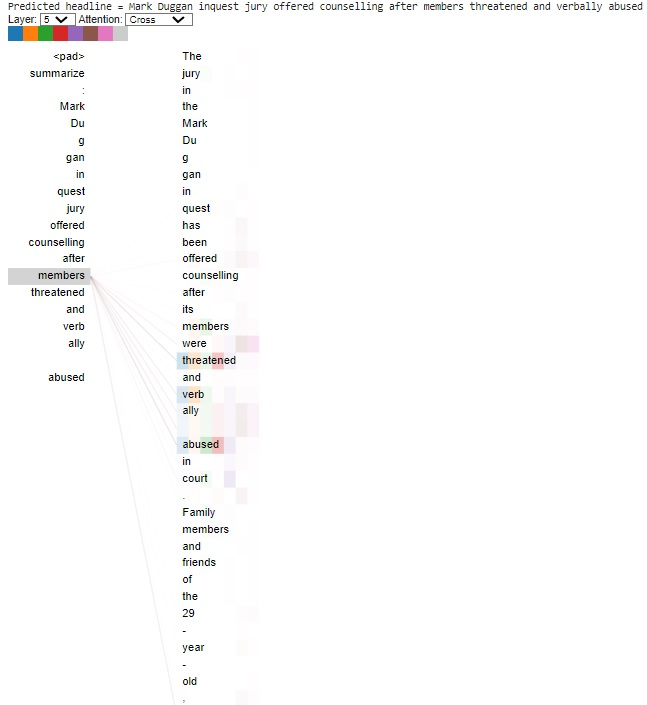
 
 

## Opinion v news scorer

This is a more traditional logistic model, which is trained to learn whether an article is tagged as opinion or news by the outlet given the words of the text. It returns a score out of 100, the higher the score, the higher the probability it should be an opinion piece.  

**Wordcloud of opinion pieces** 
 
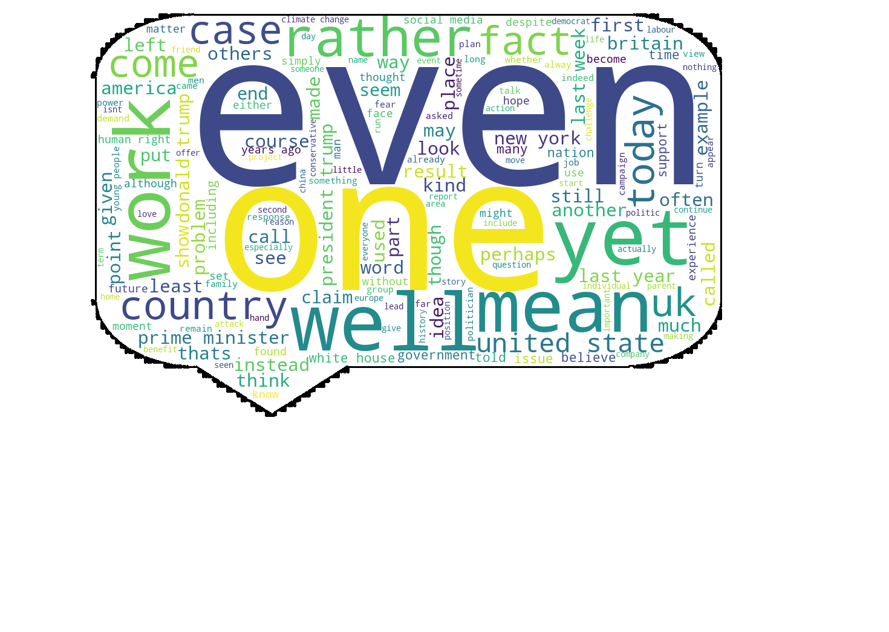

The [SHAP](https://github.com/slundberg/shap) library is then used to visualise which words in each article are most indicative of it being a news piece, and which are most indicative of an opinion piece. 

This lightweight model can easily be incorporated into existing software used by journalists to publish their copy, instantly flagging up words that may be inappropriate in a news piece. 

Initial attempts to use transformers for this job generated poor results, but with more resources to tune the model, we should get not only more accurate results, but more ways of identifying features of manipulative language. 
 

## Retweet predictor

This is also a traditional logistic model, which is trained by comparing the tweet text with how many retweets it received. 

**Wordcloud of viral tweets** 
 
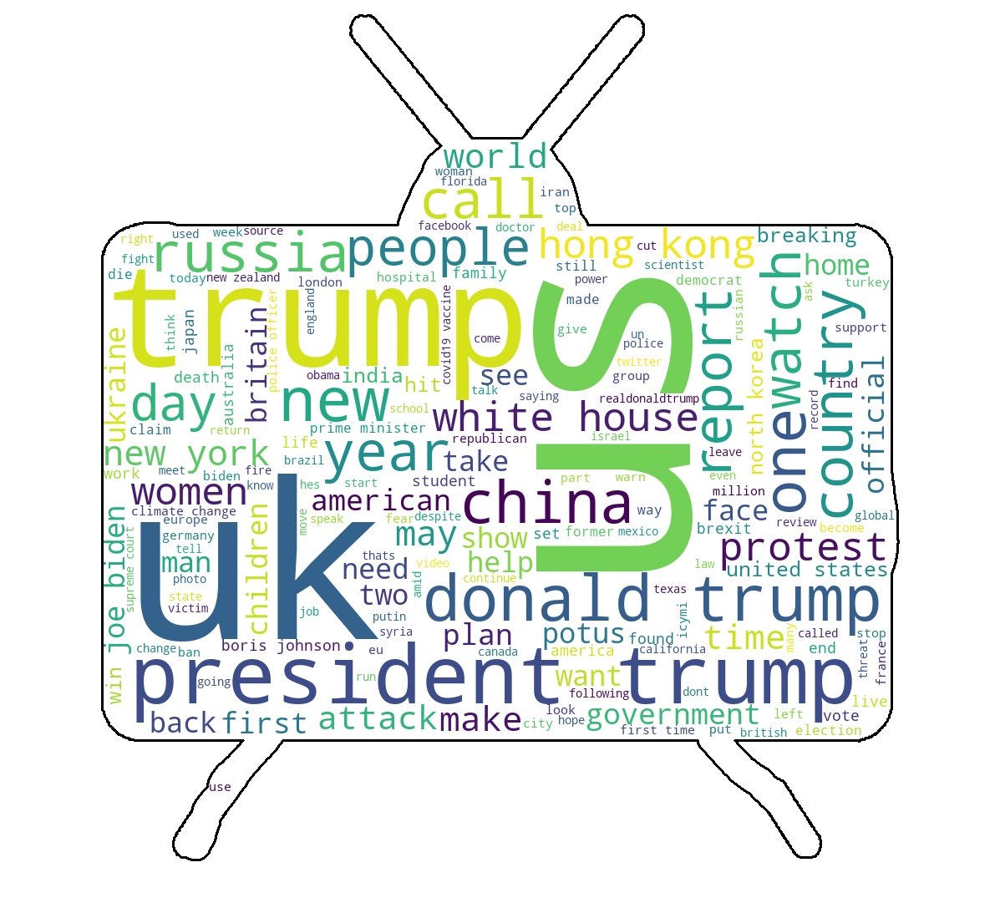

The [LIME](https://github.com/marcotcr/lime) library is then used to visualise words that tend to increase retweets, which can be used by social media teams in deciding which stories to tweet, and how to word them. 

Again, initial attempts to use a transformer model didn't generate usable results, but there is no reason why it shouldn't produce better results and deeper analysis once developed. 
 

 

## Headline and tweet summarizers 
Here are some examples of headlines generated by the model, compared with the actual headline 
 
**Article-** The jury in the mark duggan inquest, whose findings led to them being verbally abused in court, have been offered counselling... 
**Actual headline-** mark duggan inquest jury offered counselling 
**Predicted headline-** mark duggan inquest jury offered counselling to deal with strain of case  
**Article-** This month marks 65 years since the uk’s 1956 clean air act, the law that followed the coal-smoke smog that killed thousands... 
**Actual headline-** lessons to learn from uk’s 1956 clean air act 
**Predicted headline-** 65 years after the uk's 1956 clean air act, what can we learn? 

 
Datasets of 1,000 predicted headlines and tweets can be found in the "headline_pred_df" and "tweet_pred_df" files in the GitHub repository. 

The T5 model performs substantially better across various measurement metrics than the lstm model. The headline model performs better than the tweet model.
 

**Performance score of summarizer models using various Rouge metrics**
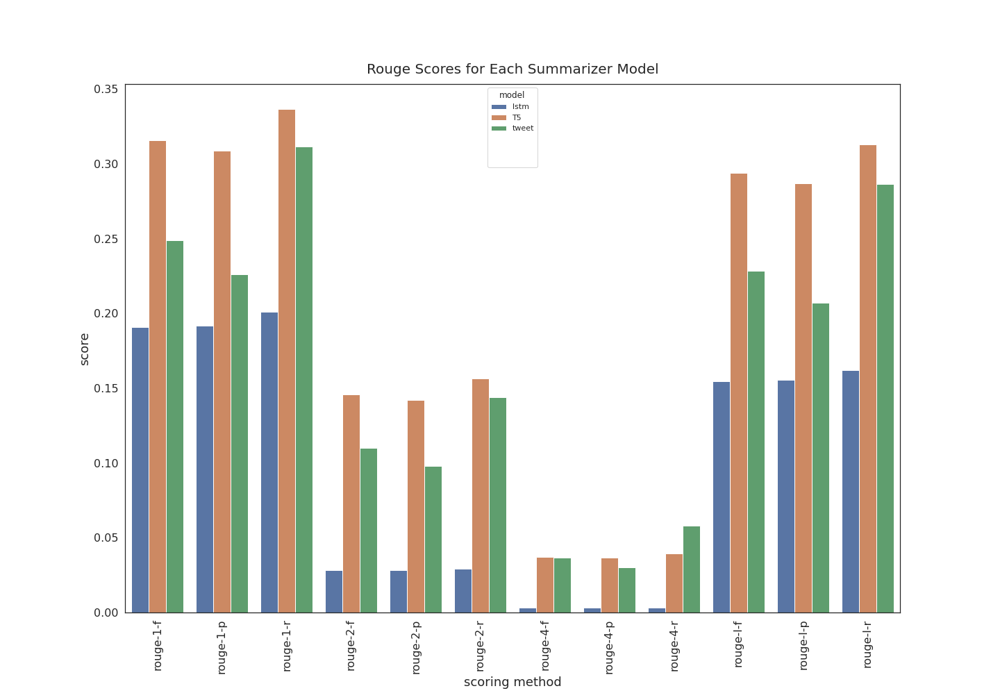
  

## Opinion v news scorer
The model is 88 percent succesful in identifying a news piece from an opinion article.
 
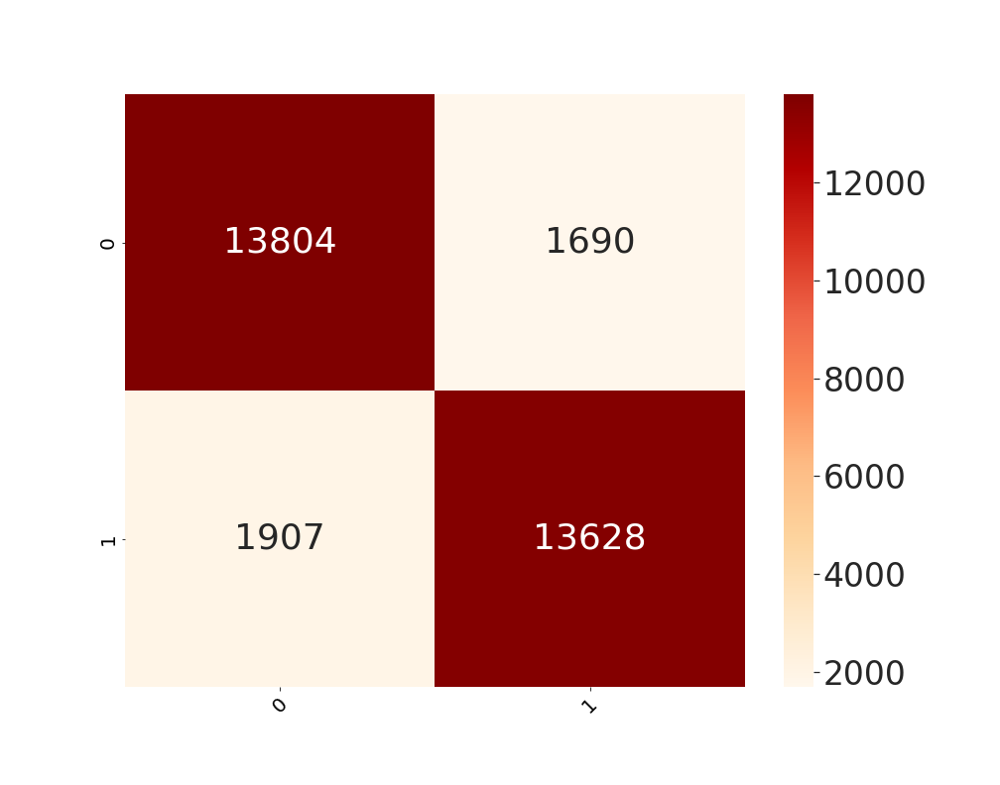

Here is an example of a score generated from an article, and the SHAP visualisation explaining which words most influenced its prediction, with the red arrows indicating 'opinion' words. 

*First 3 pars of article text used in following examples: 
Sanctioned Russian oligarchs from Vladimir Putin's inner circle exploited a UK secrecy loophole left open by the government. 
Arkady and Boris Rotenberg - judo partners of the Russian president - used a type of company that was not required to identify its real owners. 
Ministers have acknowledged concerns that these companies, known as English Limited Partnerships (ELPs), have also been abused by criminals...*  

Opinion Score 39.4% 
 

**Waterfall plot of keywords in model prediction** 
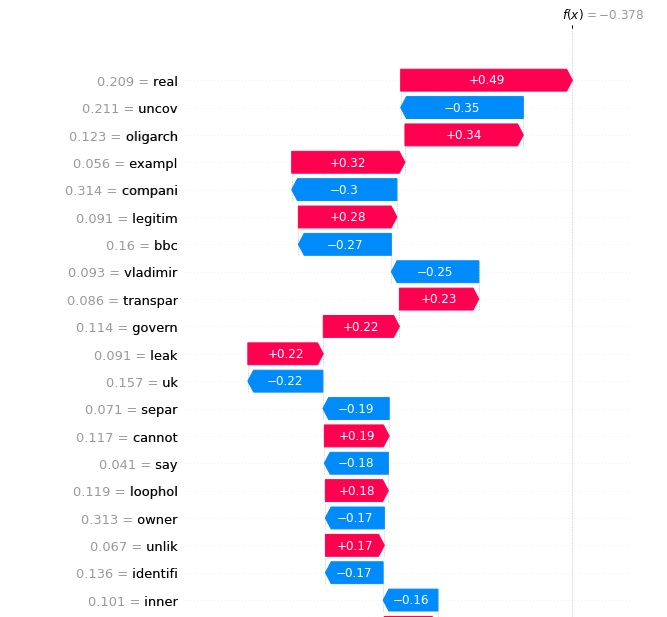  

## Retweet predictor
The model is 35 percent accurate in predicting how many retweets the tweet will receive, defined in five categories.  
The figure is quite low, but is still substantially better than random guess, and it correctly flagged up more than half of tweets that went viral. It is to be expected the results are lower given the somewhat subjective nature retweet values.
 

 
Here is an example of a retweet score generated from a tweet linked to the above article, and the LIME visualisation explaining which words most influenced the prediction. 
 
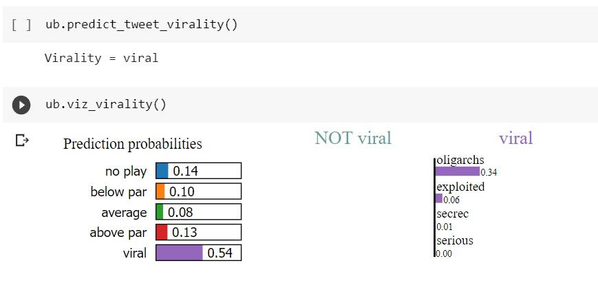  

The word vectors produced by more complex models can be plotted to show how different outlets use words. 

**Closest word vectors to 'liverpool' as learned by model on BBC articles** 
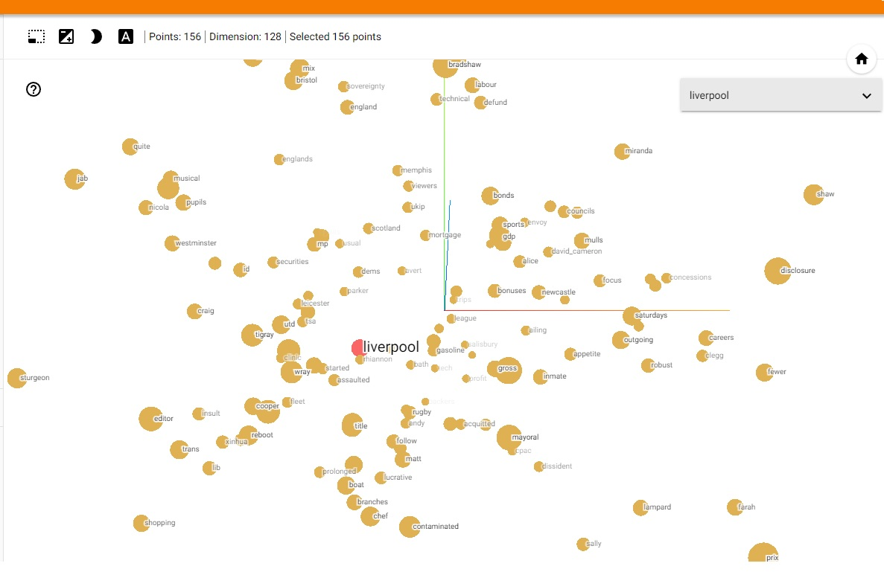  

 
The API generally produces accurate headlines. 

The T5 headline model is the best performing summarizer with a Rouge1 f-score of 31.5%. 

This is followed by the T5 tweet summarizer, which has a Rouge1 f-score of 25%, with the LSTM on 19%. 

The model's ability to learn the 'DNA' of language opens the door to multiple ways of trying to detect unbalanced reporting. 

The opinion-score generator is produced by a model that correctly predicted 88% of opinion/news tags. This model can help identify 'red-flag' words that indicate bias. 

The retweet predictor model is less accurate at 35%, but correctly flagged up 55% of viral tweets and is nevertheless a useful guide and tool in helping editors and journalist tailor coverage and tweets. 

 

Turn the API into a web app and market to news consumers. 

Develop more tools built on the encoder/decoder model. Models in development include one which gives a score of headline congruence, one that checks paraphrased quotes against the actual quotes to ensure they are fairly summarized and a sentiment analysis scorer for Named Entities, to see how skewed coverage of people and places is in different outlets. 

T5 models are also being trained on various different types of technical articles in order to give journalists instant summaries of the key findings in complex releases. 
 

  

Work will continue on the current tools to make them more accurate and to give us deeper insights. 

The headline model is pre-trained using a corpus of text. With more computing power, it would be good to diversify the training set to make sure in-built language prejudices are not continually propagated. 

The model is fine tuned on a limited number of outlets but on many different styles of articles. It would perform better if we could train on more outlets (ie ones behind paywalls), using a News API subscription, and make separate models for each main style of article. 

We will develop transformer models to power the opinion/news tool, and will also try and incorporate other techniques into the model, most obviously Parts of Speech and Named Entity analysis. 

The word vector visualisations are skewed by being trained on retweet predictions, and are under-developed as tweet summaries are short and not representative of general language use. Ideally, we should generate from articles. 

We will also develop a BERT transformer version of the retweet predictor, it seems reasonable to assume that being able contextualize words and learn syntactic characteristics will offer a significant advantage. 

The model should eventually incorporate image data too, as photographs attached to tweets are likely to be a driver of retweets. The model should also be analysable in more granular detail, giving us a 'viral vocabulary' for each subject matter. 

The multilingual capacity of transformer models means that the tools they power can easily be adapted to work in newsrooms that produce multilingual copy, such as international news agencies.  

In the longer term, we are working on a tool that will collate the most salient details of a single news story as reported across various outlets, using a transformer model to extract the most relevant features. It will then flag up potentially absent contextual details for the individual reports.  
