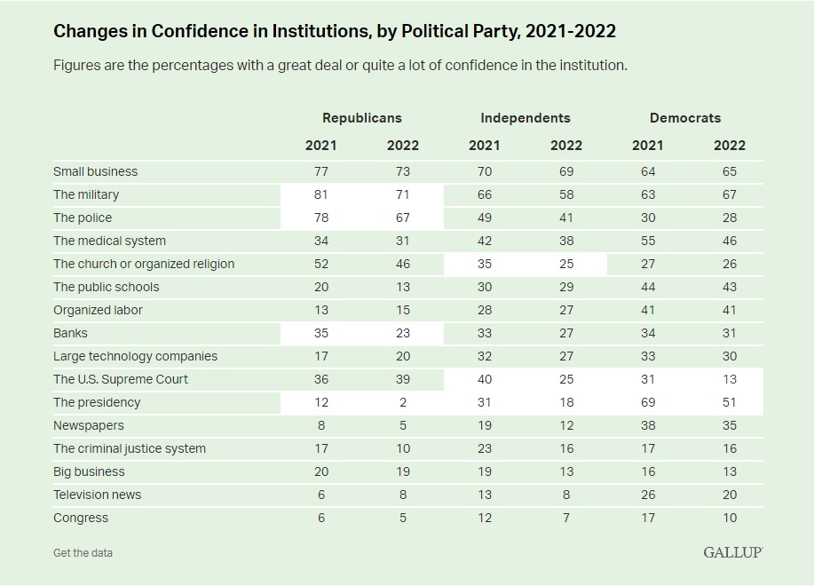
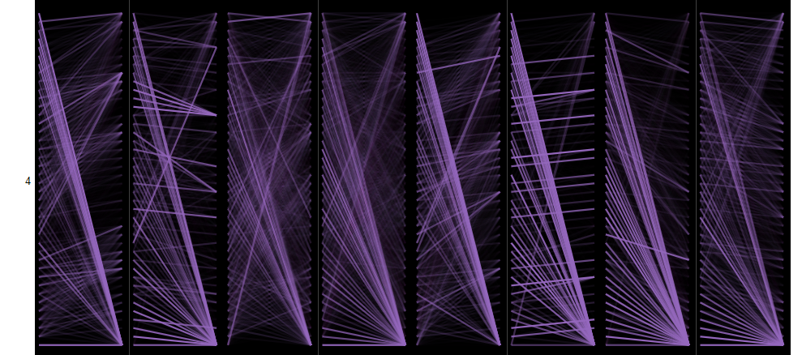
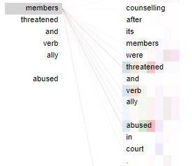
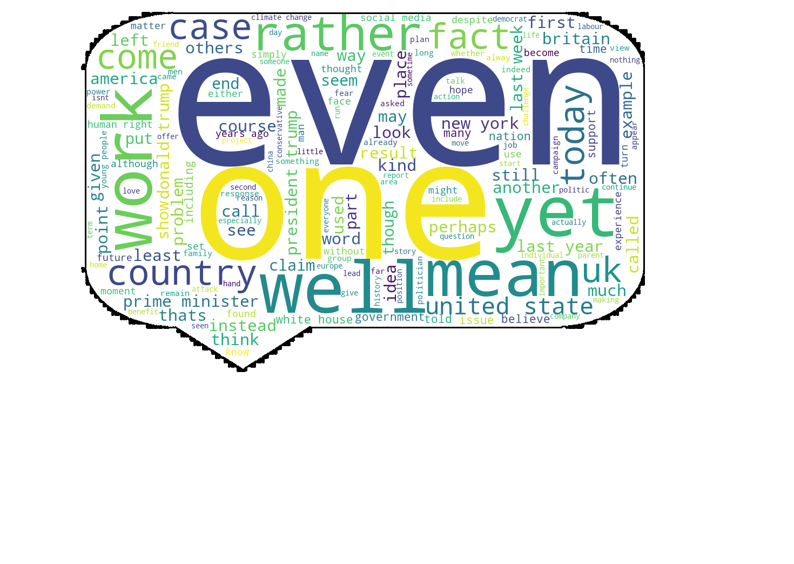
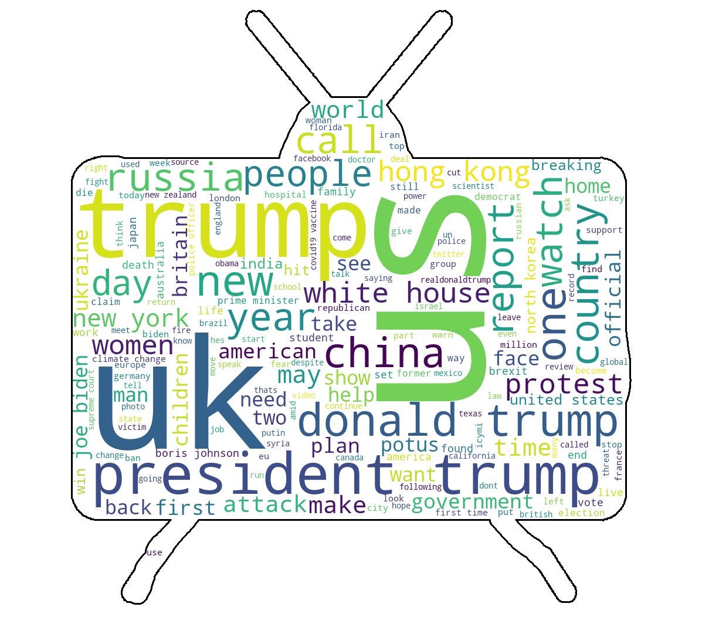
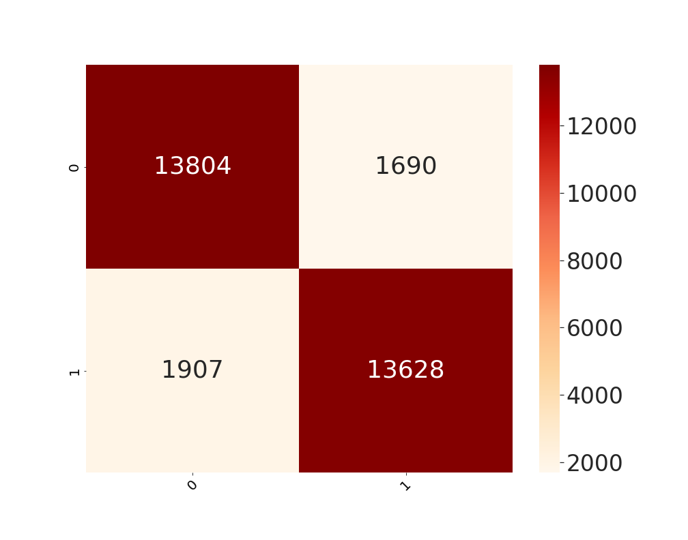
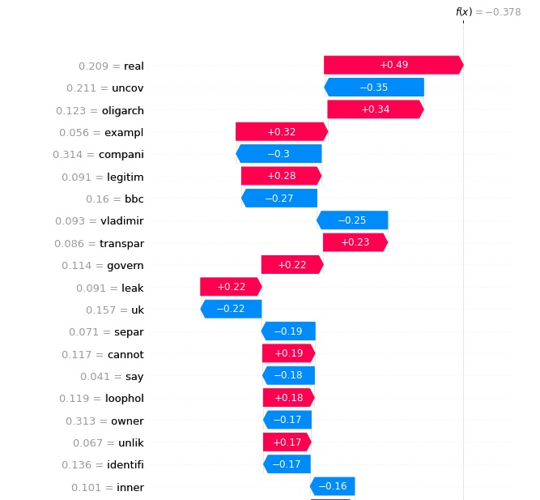
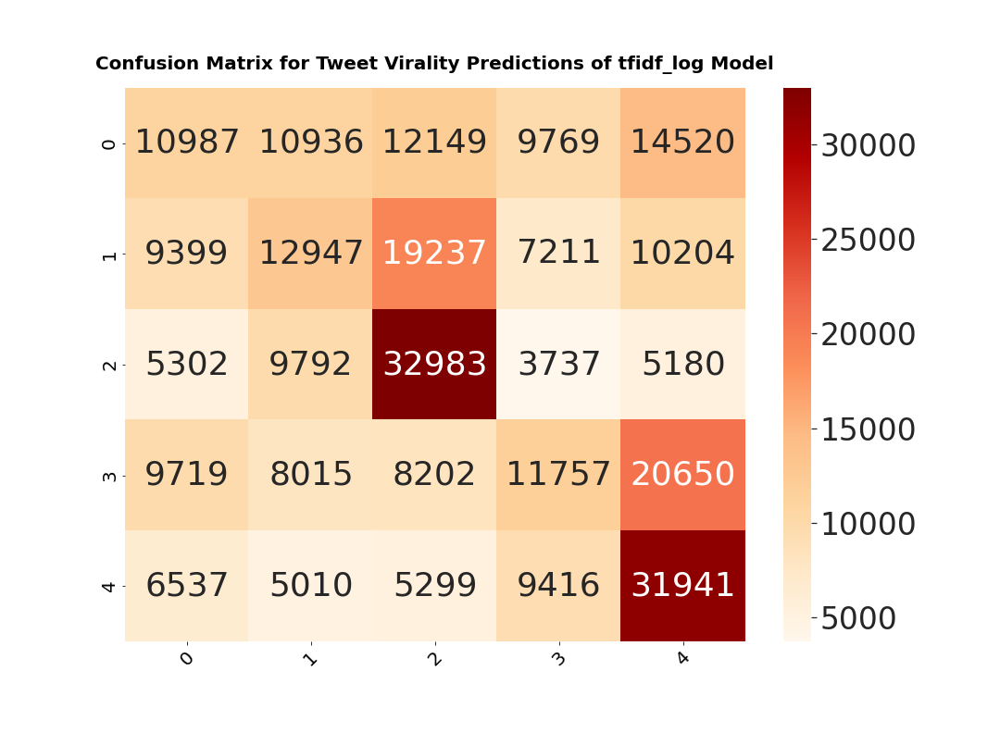
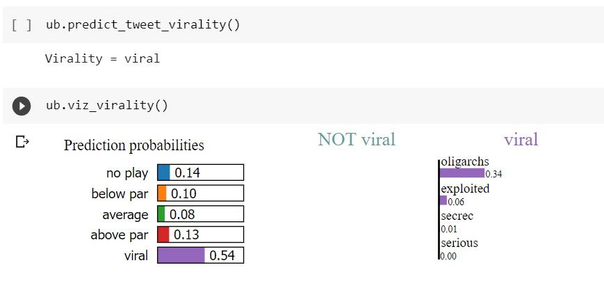
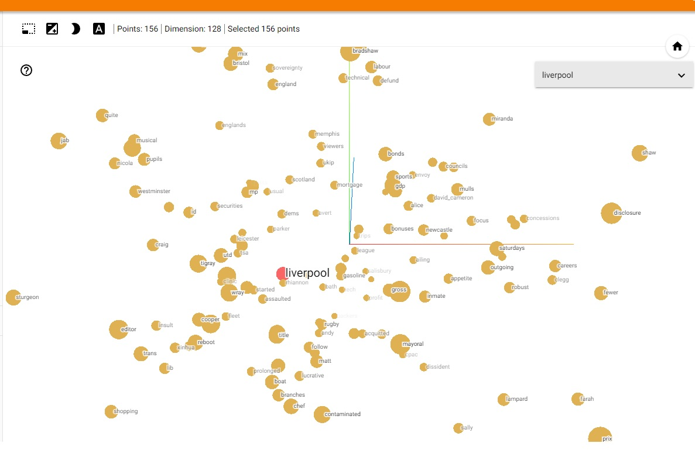

# Project Overview
FingerprintNews is an API that utilises the latest developments in Natural Langauge Processing to create a suite of tools to be used in newsrooms. 
Its models can generate accurate headlines and tweets on the fly, detect potential bias in copy and guide social media content to maximise interactions.  
 

# Business Problem

Trust in print media is at an all-time low, according to a 2022 Gallup poll.  

 

The industry has focussed heavily on so-called 'fake news', with fact-checking now a booming sector, but less attention has been paid to how the use of language has affected people's perception of the news media. 

The latest generation of NLP 'tranformer' models, similar to those that power Google's search engine, are able to encode the inner workings of language with an increasing degree of complexity. 

In the same way the human body uses the genetic code to build different parts, the models can decode these language secrets and put them to use on various tasks, promising a new world of functionality and accountability within newsrooms. 
 

**Visualisation of various linguistic relationships between words in an input sequence as learned by transformer model**
 

 

FingerprintNews can currently be used by journalists to instantly generate accurate and balanced headlines, by subeditors to identify when opinionated language is appearing in news stories, and by social media teams to quickly curate output for maximum reach. 

But this is just the beginning, with boundless potential for more applications to be added. 

 
 

# Code layout

Given memory considerations, GitHub file size restrictions and the processing power of Google Colab, the code is split between GitHub and Colab. The Colab folder can be shared on request. 

Data collection duties were shared across both platforms, with data shuttled between the two through the * *import_data* * and * *export_data* * folders in Colab. The rest of the code is on Colab. 

# The Data

The models were trained on 1.3 million news articles and 1.8 million tweets from five outlets: CNN, Fox News, The Gaurdian, Reuters and the BBC. 

Free-to-use python library [snscrape](https://github.com/JustAnotherArchivist/snscrape), was used to scrape the tweets. It returns the tweet text, URL links within the tweet and metrics such as likes and retweets.

Code for this is in global_scripts/twitterScrape.py, with the final dataframes for each outlet exported to Colab and concatenated. 

For those able to afford $1500, the articles can all be retrieved from the [News Api](https://newsapi.org) module. 

This example instead used the Internet [Wayback Machine](https://archive.org/web/) to retrieve the links to articles hosted on the outlet's homepage, going back to 2013. 

These URLs were then used to scrape the actual article and retreive the text, headline, category, and date. Guardian articles were scraped using its free api. 

Code for this step in each outlet is in * *pipe_x/scripts/x_scrape_py* *, with the final dataframes expoted to Colab and concatenated. 

The article and twitter datasets were then linked as below... 

The * *clean.eda* * scripts in each folder create another dataframe of features, for instance article text with no stopwords, which is then exported to Colab. 

# Methods

## Headline and tweet summarizers
The four models are in the * *summarizer* * folder in Colab.  

The first model is a rudimentary extractive model, to get an idea of how they can identify important passages in the text. But the model is unable to learn any complexities of language, thus serverly limiting its potential applications. 

The aim was therefore to create an inferential model which can actually learn contextual information and linguistic structure, with the headline and tweet summarizers merely the first of an array of journalistic tools to utilise this ability. 

The first inferential model is an 'lstm', the type used before the rise in popularity of transformer models. The lstm model uses cells that store the state of model so that relationships of words that appear close together and far apart can be encoded, allowing us to feed in long articles. 
 
 
**A repeating long-term short-term memory cell**
 
 

 
 
(Source : http://colah.github.io/posts/2015-08-Understanding-LSTMs)
 
 

The model trained the article text against its headline. In production, the article text is encoded by the trained model, and then decoded to generate a predicted headline, one word at a time. 

The models actually used in the API are T5 transformer models developed by Google. These models build on the lstm's capabilities, but are also able to encode words depending on their context, for instance learning the different meanings of words like 'bank' depending on other words in the sequence. 

Different 'heads' in the model learn different linguistic relationships, which can be visualised by the Bertviz module. Heads are grouped into layers, with each layer capturing more abstracted linguistic features. 

Our understanding of these inner workings and ability to analyse them are currently limited, but the profound implications as our knowledge develops are not difficult to imagine. 
 
 
**Linguistic relationship between article words and predicted headline word for one T5 layer**
 

 
 

## Opinion v news scorer

This is a more traditional logistic model, which is trained to learn whether an article is tagged as opinion or news by the outlet given the words of the text. It returns a score out of 100, the higher the score the higher the probability it should be an opinion piece.  

**Wordcloud of opinion pieces**

The SHAP library is then used to visualise the words in each article that are most indicative of it being a news piece, and an opinion piece. This lightweight model can easily be incorporated into software used by journlaists to publish their copy, instantly flagging up words that may be inappropriate in a news piece. 

Initial attempts to use transformers for this job generated poor results, but with more resources to tune the model, we should get not only more accurate results, but more ways of identifying features of manipulative language. 

## Retweet predictor

This is also a traditional logistic model, which is trained by comparing the tweet text with how many retweets it received. 

**Wordcloud of viral tweets** 

The LIME library is then used to visualise the words that tend to increase retweets, which can be used by social media teams in deciding which stories to tweet, and how to word them. 

Again, initial attempts to use transformers didn't generate usable results, but there is no reason why it shouldn't produce better results and deeper analysis once devloped. 
 
 

# Headline Results
 

##Headline and tweet summarizers**  
Here are some examples of headlines generated by the model, compared with the actual headline 
 
**Article-** The jury in the mark duggan inquest, whose findings led to them being verbally abused in court, have been offered counselling... 
**Actual headline-** mark duggan inquest jury offered counselling 
**Predicted headline-** mark duggan inquest jury offered counselling to deal with strain of case  
**Article-** his month marks 65 years since the uk’s 1956 clean air act, the law that followed the coal-smoke smog that killed thousands... 
**Actual headline-** lessons to learn from uk’s 1956 clean air act 
**Predicted headline-** 65 years after the uk's 1956 clean air act, what can we learn? 

The T5 model performs substantially better across various measurment metrics than the lstm model. The headline model performs better than the tweet model.
 

**Performance score of summarizer models using various Rouge metrics**

  

## Opinion v news scorer
 
The model is 88 percent succesful in identifying a news piece from an opinion article.
 

Here is an example of a score generated from an article, and the SHAP visualisation explaining which words most influenced its prediction, with the red arrows indicating 'opinion' words. 

First 3 pars of article text used in following examples: 
Sanctioned Russian oligarchs from Vladimir Putin's inner circle exploited a UK secrecy loophole left open by the government. 
Arkady and Boris Rotenberg - judo partners of the Russian president - used a type of company that was not required to identify its real owners. 
Ministers have acknowledged concerns that these companies, known as English Limited Partnerships (ELPs), have also been abused by criminals...  

Opinion Score = 39.39 percent 

**Waterfall plot of keywords in model prediction** 
  

## Retweet predictor
 
The model is 35 percent accurate in predicting how many retweets the tweet will receive, as defined in five categories. The figure is quite low, but is still substantially better than random guess, and it correctly flagged up almost half of tweets that went viral. It is to be expected the results are lower given the somewhat subjective nature retweet values.
 

 
Here is an example of a retweet score generated from a tweet linked to the above article, and the LIME visualisation explaining which words most influenced the prediction. 
Virality-'viral' 
  

The word vectors produced by more complex models can be plotted to show how different outlets use words. 

**Closest word vector to 'liverpool' as learned by model on articles** 
  

### Conclusion

* The model is definitely accurate enough to suggest it could become a viable product, both internally and commercially, with more resources.

* It also generates useful insights, potentially revealing hidden threads that run through categories and generating story angles. It can also help in analysing reporting standards in our own copy.

### Next steps

* Provide funds for more storage space and processing power to enable the models to be better 'tuned' and to enable more advanced processing techniques on the article to help it discern between overlapping categories

* Channel more resources into analyzing the workings of the model to find hidden insights. The model can easily be linked to Twitter analytics, or to other metadata tags such as byline to glean distinctive features of successful writers or stories that play well on social media
 

 
 

